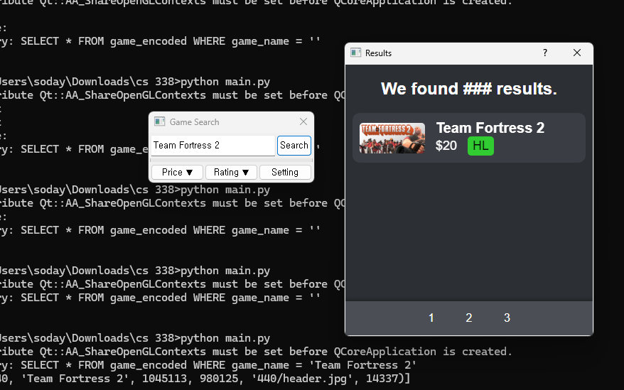
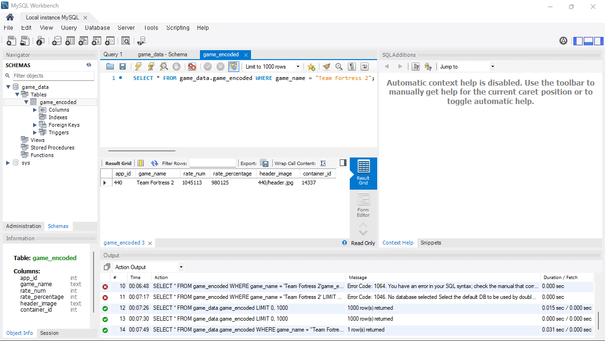

# CS-338-Group-Project


## Instructions for Use


### Requirements
This program uses the following Python modules:
- PyQt5
- MySQL Connector for Python

You can install them with the following commands:
```
pip install pyqt5
pip install mysql-connector-python
```



Database Setup
1. Load CSV:
  Upload the file *game_encoded.csv* to your MySQL database.
2. Access the Database:
  You can check the import with the following SQL command:
```
SELECT * FROM game_data.game_encoded WHERE game_name = "Team Fortress 2";
```
